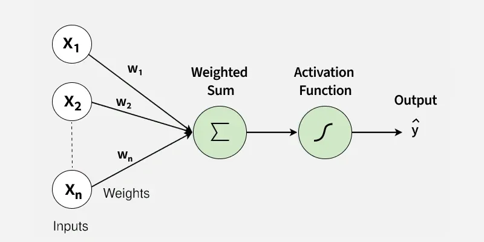

# perceptron-from-scratch

Perceptron from scratch

Developed a perceptron from scratch in Python to thoroughly understand its core principles.

### What is perceptron?

A perceptron is the simplest neural network that takes inputs, multiplies them by weights, adds a bias, and uses a step function to return 1 if the value is 0 or greater, and 0 if it is less than 0.



### How does it learn?

The perceptron only updates its weights when it makes a wrong prediction

```python
error = target - pred
weights[i] = lr*error*inputs[i]
bias = lr*error
```

- Inputs that were 0 do not affect the prediction, so their weights stay the same.
- `lr` (learning rate) controls how big each correction is.
- The data is passed through repeatedly (epochs) until no sample is wrong.


